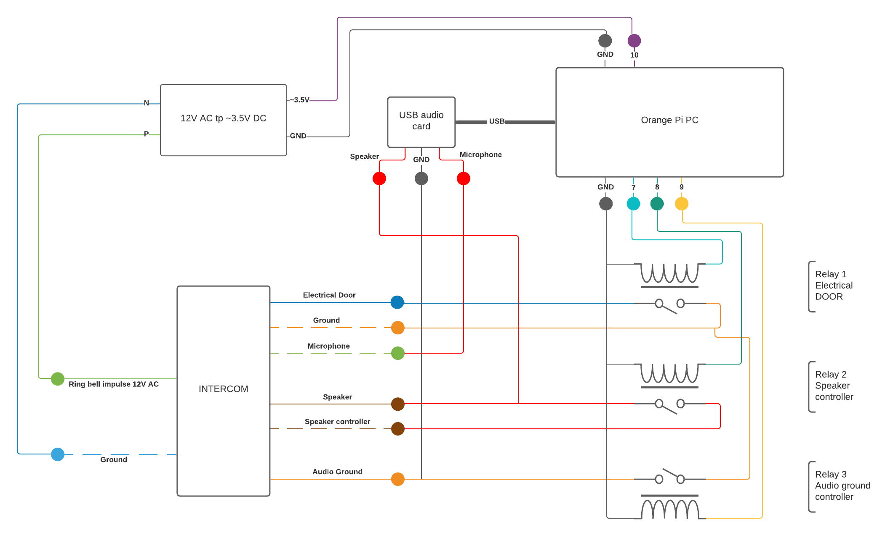

# intercom-bot
Telegram bot that manages a traditional, old school, intercom

## Dependencies
- node
- npm
- mpv
- lame (mp3 encoder)

## Configuration

- Create a telegram bot and get the token
- If you want telegram to autocomplete commands, send this message to botfather when asked:
  ```
  users - List bot users
  banned - List banned users
  open - Open the door
  record - Record a short audio
  party - Enable/Disable party mode
  ```
- Create a user named `intercombot`
  ```
  useradd --create-home intercombot
  ```
- Add user to group audio
  ```
  gpasswd -a intercombot audio
  ```
- Clone this repo in the ssh bot's home folder (`/home/intercombot`)
- Create the config file `/home/intercombot/intercom-bot/secrets.json`
  ```
  {
    "token" : "YOUR_TOKEN_HERE",
    "admin" : "YOUR_TELEGRAM_USERNAME_HERE",
    "door_pin" : PIN_NUMBER_HERE,
    "bell_pin" : PIN_NUMBER_HERE,
    "audio_pins": [PIN_NUMBER_HERE, PIN_NUMBER_HERE, ...],
    "webserver": true,
    "https_port": PORT,
    "webtoken": SUPER_SECRET_TOKEN
  }
  ```
  Where:
  - `token` is the bot token provided by the botfather,
  - `admin` is your telegram username
  - `door_pin` is the gpio pin number that will trigger the door opening
  - `bell_pin` is the gpio pin number that will detect when the intercom button is pressed
  - `audio_pins` are the gpio pin numbers that will trigger the relays that will connect the speaker and mic to the intercom
  - `webserver` is true if you want to activate the https endpoint for external applications integration, if so you will have to follow the instructions at the end of this file in order to get it online
  - `https_port` is the port that will be used by the https webserver, note that if you want to trigger the door opening from the internet, you will have to configure your router in order to open that door to the external world
  - `webtoken` is a SUPER SECRET token that has to be sent to the https webserver in order to trigger the door opening. If this is kept very secret and https is used correctly there shouldn't be security issue, this is not the right way to authenticate a http endpoint though, but some external applications I was using wouldn't let me do anything else (IFTTT)
- Run `npm install` in the project folder
- Set up your device audio in a way that the default audio card is the one that you want the bot to use, in my case:
  - List the available devices:
  ```
  carlo@orangepipc:~$ aplay -l
  **** List of PLAYBACK Hardware Devices ****
  card 0: Codec [H3 Audio Codec], device 0: CDC PCM Codec-0 [CDC PCM Codec-0]
    Subdevices: 1/1
    Subdevice #0: subdevice #0
  card 1: Device [USB PnP Sound Device], device 0: USB Audio [USB Audio]
    Subdevices: 1/1
    Subdevice #0: subdevice #0
  card 2: sun8ih3hdmi [sun8i-h3-hdmi], device 0: 1c22800.i2s-i2s-hifi i2s-hifi-0 [1c22800.i2s-i2s-hifi i2s-hifi-0]
    Subdevices: 1/1
    Subdevice #0: subdevice #0
  ```
  The right one is
  ```
  card 1: Device [USB PnP Sound Device], device 0: USB Audio [USB Audio]
    Subdevices: 1/1
    Subdevice #0: subdevice #0
  ```
  So i will create/edit the file `/etc/asound.conf` like this:
  ```
  pcm.!default {
      type hw
      card 1
      device 0
  }

  ctl.!default {
      type hw
      card 1
  }
  ```
  After a reboot, it should be the default audio device, remember to adjust your volumes with `alsamixer`
- Create your audio files using this cool site: [ttsmp3](https://ttsmp3.com/) and put them in the audio folder, these are the files:
  - `not_at_home.ogg` this should say something link "I'm not at home right now, please send me a message after the beep", after that the bot will start recording for 10 seconds and the send you the audio file
  - `call_me.ogg` this should say your telephone number
  - `leave_the_package_inside.ogg` this should instruct a delivery man to hide a package of yours, after that the door will open
- Place some audio files you want to be able to play when someone rings the bell in the folder `audio/custom`, please be sure that filenames have *no spaces*.
  Note that this callback will not record any response, in order to do that you'll have to send the /record command on completition.
- Allow him to run the tee command as root without a password, run `visudo` and add this line at the end of that file, where N1, N2, ... are the gpio pin numbers that you will be using (the ones that are specified in `the secrets.json` file)
  ```
  intercombot ALL= NOPASSWD: /usr/bin/tee /sys/class/gpio/export, /usr/bin/tee /sys/class/gpio/gpioN1/value, /usr/bin/tee /sys/class/gpio/gpioN1/direction, /usr/bin/tee /sys/class/gpio/gpioN2/value, /usr/bin/tee /sys/class/gpio/gpioN2/direction, ...
  ```
- Create the service file `/lib/systemd/system/intercom-bot.service`
  ```
  [Unit]
  Description=INTERCOM telegram bot.

  [Service]
  Type=simple
  User=intercombot
  WorkingDirectory=/home/intercombot/intercom-bot
  ExecStart=/usr/bin/node bot.js
  Restart=on-failure
  RestartSec=5s

  [Install]
  WantedBy=multi-user.target
  ```
- Reload systemd services with
  ```
  systemctl daemon-reload
  ```
- Enable and start the newly created service (and check its status)
  ```
  systemctl enable intercom-bot
  systemctl start intercom-bot
  systemctl status intercom-bot
  ```

## Optional: https endpoint for external applications intergration
To do list:
- Generate a self-signed certificate:
  ```bash
  openssl genrsa -out key.pem
  openssl req -new -key key.pem -out csr.pem
  openssl x509 -req -days 9999 -in csr.pem -signkey key.pem -out cert.pem
  rm csr.pem
  ```
  This should leave you with two files, `cert.pem` (the certificate) and `key.pem` (the private key), put them in the `web/` directory
- Set to true the option `webserver` in secrets.json and set the port and the token for the webserver.
- Requests should be sent in this format:
  - Method `POST`
  - Content (json-formatted):
    ```
    {
        "action": "open",
        "token": "SUPER_SECRET_TOKEN"
    }
    ```

## Schematics

Here you are the schematics of my layout, I honestly think that it won't be useful to anyone because it's very specific



